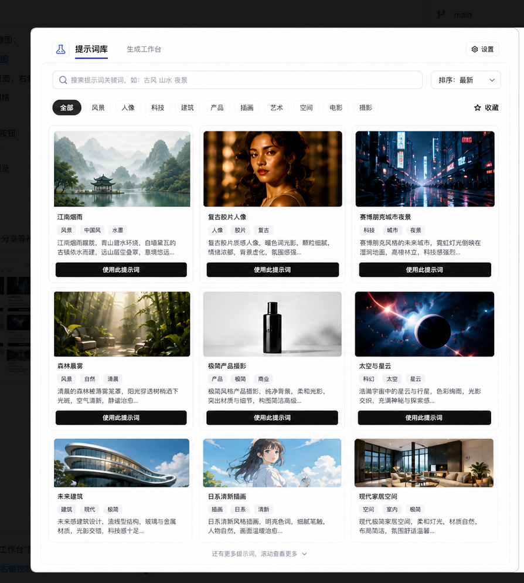
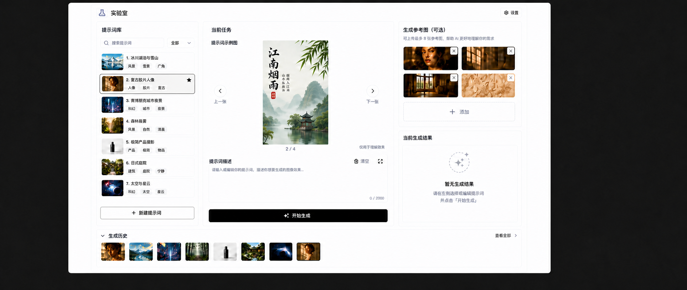
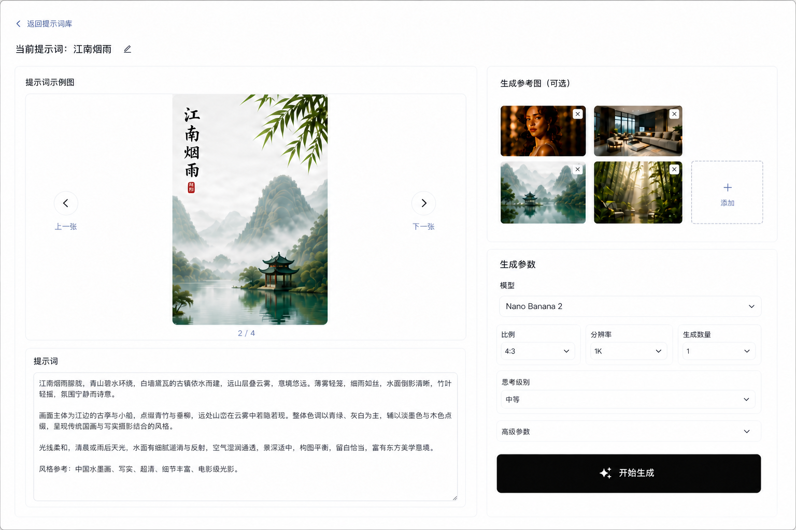
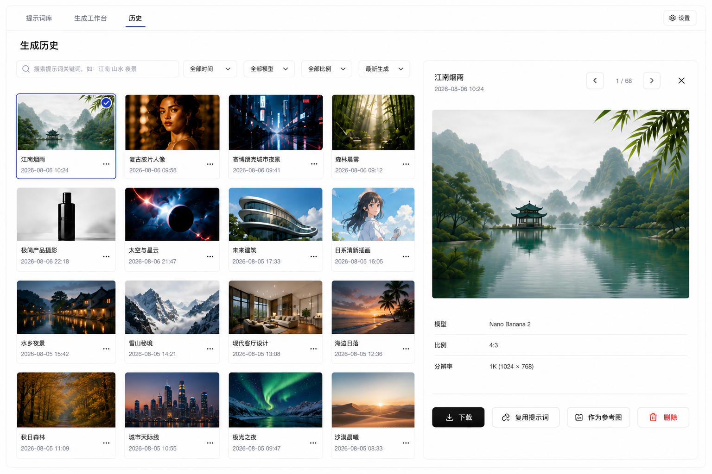
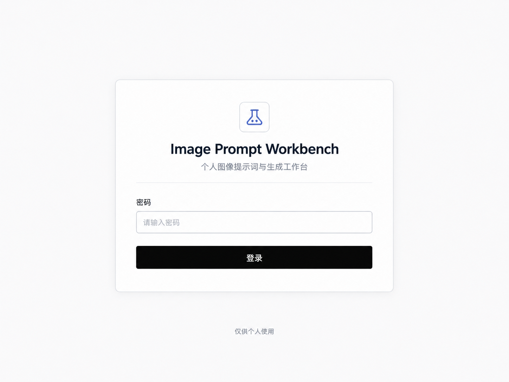

# Image Prompt Workbench 个人生成工作台设计

## 1. 文档状态

- 状态：已确认设计，待实现
- 日期：2026-08-02
- 目标：将当前的提示词卡片浏览页面调整为面向个人使用的图像生成工作台
- 约束：保留现有提示词卡片数据和多图能力；不引入社区、分享、点赞、评论、作者主页等功能

## 2. 最终视觉稿

最终采用浅色 AI 创作工作台风格：白色背景、浅灰边框、黑色主按钮、克制的圆角和阴影。产品拆分为“提示词库”首页、“生成工作台”页和“生成历史”页：首页负责浏览和选择提示词，生成工作台负责编辑提示词、添加生成参考图和设置生成参数，生成历史页负责浏览和管理全部生成结果。生成参考图和历史缩略图使用 4:3 卡片，默认展示 4 个位置，有 6 张图片时自然扩展为 2 列 3 行。


### 首页：提示词库

首页以提示词卡片网格为核心，包含搜索、排序、分类筛选、收藏入口和“使用此提示词”操作。首页不出现提示词编辑器、生成参考图、生成参数、生成结果或生成历史。



### 长图显示示例

下面的示例用于说明：当提示词示例图是竖向长图时，仍然放在固定尺寸的横向展示区域中，图片按原始比例完整缩放，左右保留留白，不改变展示区高度。



### 当前确认的生成工作台示例

当前生成页只负责准备一次生成任务：左侧编辑提示词并浏览提示词示例图，右侧选择生成参考图、设置生成参数并开始生成。生成结果和生成历史不放在本页，后续单独设计新页面。



### 生成历史页：方案 A 画廊网格

历史页采用画廊网格方案：左侧展示全部生成记录的 4:3 缩略图，右侧展示当前选中的单张大图和个人操作。该页面支持搜索、时间、模型、比例和排序筛选。



### 登录页

登录页沿用同一套浅色工作台视觉：白色背景、细灰边框、黑色主按钮和克制的圆角。由于项目是个人使用工具，登录页只保留单密码登录，不增加注册、社交登录或营销入口。



设计稿文件：

- `docs/superpowers/specs/assets/image-prompt-workbench-prompt-library.png`
- `docs/superpowers/specs/assets/image-prompt-workbench-generation-workspace.png`
- `docs/superpowers/specs/assets/image-prompt-workbench-generation-history-gallery.png`
- `docs/superpowers/specs/assets/image-prompt-workbench-long-image-display.png`
- `docs/superpowers/specs/assets/image-prompt-workbench-login.png`

设计稿只作为视觉和布局基准，不代表最终文案、图片内容或后端接口已经实现。

## 3. 术语标准

项目统一使用以下三个核心术语：

### 3.1 提示词示例图

指随下载提示词一起获取的图片，用于展示该提示词可能生成的效果。

- 来源：远程提示词资料或提示词卡片
- 用途：浏览、对照和理解提示词的效果
- 状态：只读
- 默认行为：不会自动参与新的生成请求
- 交互：可以使用上一张、下一张浏览同一提示词下的多张图片

### 3.2 生成参考图

指用户在一次生图任务中主动上传或选择的图片，用于约束人物、场景、产品、构图或其他视觉特征。

- 来源：用户本地上传，或用户主动从提示词示例图、生成历史中选择
- 用途：作为本次生成请求的输入条件
- 状态：可添加、删除和替换
- 默认行为：只有被加入当前任务后才会参与生成

### 3.3 生成结果与生成历史

生成结果是当前任务实际生成出的图片。生成历史是过去生成结果的集合。

- 右侧区域显示当前生成结果
- 底部区域显示生成历史缩略图
- 查看历史图不会自动替换当前生成结果
- 历史图可以通过“作为参考图”加入新的生成任务
- 历史图可以通过“复用提示词”创建新的任务草稿

关系可以概括为：

```text
提示词示例图：用于理解别人用提示词生成过什么效果
生成参考图：用于告诉模型本次需要参考什么素材
生成结果：本次任务实际生成了什么
生成历史：过去生成过什么，并支持再次复用
```

## 4. 页面结构

当前最终采用“提示词库页 + 生成工作台页 + 生成历史页”三页面结构。下方早期三栏描述仅保留为讨论记录，实际实现以第 11 节“当前确认的页面结构”为准。

### 4.1 左侧：提示词库

左侧用于选择和筛选提示词。

- 搜索框
- 分类筛选
- 提示词卡片列表
- 每张卡片显示一张封面图、标题和分类标签
- 封面图代表该提示词的提示词示例图，不代表生成结果
- 底部保留“新建提示词”入口

点击提示词卡片后，中间区域加载该卡片的提示词文本和提示词示例图。

### 4.2 中间：当前任务（早期讨论记录）

本节保留早期讨论内容，当前实现以第 11 节和第 13 节为准。

中间区域是主要操作区，负责理解示例、编辑提示词和发起生成。

#### 提示词示例图浏览器

- 一次只显示一张图片
- 使用上一张、下一张按钮切换
- 使用 `当前序号 / 总数` 显示位置，例如 `2 / 4`
- 使用 `object-fit: contain`，不裁剪、不拉伸图片
- 图片尺寸变化时，容器尺寸保持稳定
- 显示“仅用于理解效果”提示

#### 长图处理原则

- 展示区尺寸固定，保持当前横向宽图的比例和高度，不因图片原始比例变化而撑高或变窄。
- 图片始终按原始比例等比缩放，使用 `contain` 完整显示，不裁剪、不拉伸、不溢出展示区。
- 竖向长图在固定横向展示区内居中显示，左右使用自然留白；横向宽图则尽可能利用展示区宽度。
- 留白属于展示区的一部分，使用浅灰或白色背景，不把留白误认为图片内容。
- 本次只使用固定展示区快速理解效果，不新增全屏阅读、内部滚动或缩放。
- 上一张、下一张和当前序号的位置保持不变，切换图片时不改变页面整体布局。

#### 提示词编辑器

- 显示当前提示词文本
- 支持直接编辑
- 不额外提供清空按钮或字符数统计
- 允许用户在生成前修改下载的原始提示词
- 编辑内容属于当前任务草稿，不直接修改数据库中的原始提示词卡片

#### 唯一的生成按钮

中间编辑器下方只保留一个全宽黑色“开始生成”按钮。

- 页面只允许存在一个主生成入口
- 生成按钮提交当前提示词和右侧已选择的生成参考图
- 本次前端原型只显示就地提交反馈，不展示虚构的生成进度或结果
- 右侧不再放置第二个“开始生成”按钮

### 4.3 右侧：生成参考图与当前生成结果（早期讨论记录）

本次实现只包含生成参考图；当前生成结果属于后续独立页面，不放在工作台中。

右侧分为上下两个区域。

#### 生成参考图

右侧上方放置“生成参考图（可选）”。

- 使用横向长方形缩略图，建议使用约 3:2 的比例
- 默认采用 2 列 2 行，优先展示 4 个位置
- 有 6 张图片时扩展为 2 列 3 行，缩略图比例保持不变
- “添加”入口使用与图片相同尺寸和比例的虚线长方形卡片
- 每张缩略图提供删除入口
- 保留“添加”入口，用于选择本地图片
- 不同长宽比图片统一使用 contain 展示，避免裁剪
- 本次前端原型不实现数量适配、内部滚动或展开管理；图片数量增加时网格自然换行

提示词示例图和生成参考图必须在视觉上明确区分：前者只读，后者可编辑并参与当前请求。

#### 当前生成结果

当前生成结果不在本次工作台中实现，后续单独设计页面。

## 5. 生成历史交互（后续页面讨论记录）

本节不属于本次生成工作台实现范围。

底部保留“生成历史”横向区域，默认显示若干缩略图和“查看全部”入口。

### 5.1 查看历史图片

- 点击历史缩略图后打开全屏预览层
- 全屏预览只显示一张图片
- 支持上一张、下一张和关闭
- 支持下载
- 查看历史图片不会替换右侧当前生成结果

### 5.2 复用历史图片

全屏预览或历史详情中提供明确操作：

- “作为参考图”：加入当前任务右侧的生成参考图
- “复用提示词”：使用历史记录中的提示词创建任务草稿
- “设为当前结果”：在用户明确操作后替换右侧当前结果

查看、作为参考图、设为当前结果三种行为必须分开，避免点击图片后产生隐式状态变化。

## 6. 主要状态（本次原型采用的状态）

页面需要覆盖以下状态：

| 状态 | 页面显示 | 主按钮 |
| --- | --- | --- |
| 正在读取提示词 | 显示加载提示 | 不可用 |
| 没有可用提示词 | 显示空状态和返回入口 | 不可用 |
| 已选择提示词 | 显示示例图、提示词和空的参考图区 | 可用 |
| 提示词被清空 | 保留页面内容 | 不可用 |
| 已添加参考图 | 显示参考图缩略图和参数 | 可用 |
| 本地提交完成 | 保留全部内容并显示就地反馈 | 可再次提交 |
| 读取失败 | 显示错误信息和返回入口 | 不可用 |

错误信息应显示在相关内容附近，不使用全局弹窗替代上下文提示。

## 7. 视觉规范

- 主题：浅色
- 页面背景：白色或极浅灰色
- 面板：白色，使用浅灰色细边框
- 主文字：近黑色
- 主按钮：黑色背景、白色文字
- 次要按钮：白色背景、黑色边框和文字
- 圆角：统一使用小圆角，避免按钮、卡片和面板混用不同形状体系
- 阴影：轻量、低对比度，仅用于层级区分
- 图片：保持原始比例，默认使用 `contain`
- 动效：只用于加载、切换、预览打开和按钮反馈，不做装饰性循环动画
- 可访问性：按钮文字、输入框文字和焦点状态需要满足可读性要求

## 8. 数据与实现边界

当前提示词卡片数据中的 `images` 数组代表提示词示例图，不应与用户上传的生成参考图或生成历史混用。

建议在任务状态中单独维护：

```text
当前提示词卡片
当前提示词草稿
当前提示词示例图索引
当前生成参考图列表
生成参数
本地提交反馈与错误信息
```

原始提示词卡片保持只读。用户编辑的是任务草稿。参考图只在浏览器本地预览，提交按钮只产生本地演示反馈，不回写提示词内容，也不创建生成历史记录。

## 9. 验收标准

当前生成工作台的验收以第 11 节为准；其中涉及生成结果和生成历史的旧版条目属于后续页面，不作为本页面实现要求。

- 页面只显示一个“开始生成”主按钮
- 提示词示例图一次只显示一张，并支持上一张、下一张
- 示例图不会被裁剪或拉伸
- 生成参考图位于右侧，使用小缩略图显示
- 生成参考图支持添加和删除
- 提示词可以直接编辑，且不显示清空按钮或字符数统计
- 生成参数包含模型、比例、分辨率、生成数量、思考级别和可折叠高级参数
- 提交后页面停留在工作台，并显示就地反馈
- 所有社交相关信息不出现在个人工作台中
- 桌面端布局与本设计稿保持一致

## 10. 不在本次设计范围内

- 社区、作者、点赞、评论、分享和关注
- 用户注册、多用户权限和计费
- 在线 API 设置页面
- 完整图片编辑器
- 移动端专门布局
- 多模型管理界面
- 生成结果页的最终结构

## 11. 当前确认的页面结构

### 11.1 页面一：提示词库

提示词库是独立页面，负责浏览、搜索、筛选和选择提示词。页面使用卡片网格展示提示词，图片容器统一为 4:3。卡片只显示封面图、标题、标签、提示词摘要和“使用此提示词”操作，不显示作者、点赞、评论、分享或其他社交信息。

提示词数量较多时，提示词库页面自身滚动。本次只新增从卡片进入生成工作台的入口，不额外改动提示词库的筛选和滚动行为。

### 11.2 页面二：生成工作台

生成工作台只负责准备一次生成任务，页面不显示生成结果和生成历史。

左侧区域只包含：

- “提示词示例图”：固定 4:3 展示区，一次显示一张，支持上一张、下一张和当前序号
- “提示词”：可编辑的提示词文本区域

右侧区域只包含：

- “生成参考图（可选）”：4 张 4:3 缩略图，采用 2 列布局，并提供同样比例的“添加”卡片
- “生成参数”：模型、比例、分辨率、生成数量、思考级别和可折叠高级参数
- 唯一的黑色“开始生成”按钮

本页面不设置“输出格式”参数。当前工作台的目标是生成图片，输出类型默认就是图片，不需要额外提供“图片 / 图片与文本”等选项。

### 11.3 页面跳转与任务边界

- 从提示词库点击“使用此提示词”进入生成工作台
- 进入时自动带入提示词文本和提示词示例图
- 提示词示例图只用于理解效果，不自动加入生成参考图
- 生成参考图必须由用户主动添加；本次实现支持从本地选择图片，从提示词示例图或历史记录中选择属于后续页面
- 点击“开始生成”只提交当前提示词、参考图和生成参数
- 本次前端原型点击“开始生成”后留在当前页，显示“已创建本地生成任务（演示）”反馈
- 本次不连接真实生图接口，不跳转生成历史页，也不展示生成结果

### 11.4 页面三：生成历史

生成历史页采用方案 A“画廊网格”，负责浏览和管理全部历史生成结果。

- 首页和生成工作台页的顶部导航都提供“历史”入口
- 历史页默认显示全部生成结果，以 4:3 缩略图网格展示
- 缩略图显示生成图片、提示词标题和生成时间，不显示社交信息
- 支持按关键词、时间、模型、比例和生成时间排序筛选
- 点击缩略图后，在右侧打开单张大图预览；大图支持上一张、下一张和关闭
- 大图预览提供“下载”“复用提示词”“作为参考图”“删除”操作
- 预览区显示必要参数：模型、比例、分辨率和生成时间
- 长图缩略图使用 `contain` 完整显示；大图预览支持按宽度阅读、滚动和缩放
- 新生成的任务跳转后排在最前面；生成中显示进度状态，完成后自动更新为生成结果
- 历史页不承担提示词编辑、生成参数编辑或结果页的复杂操作

## 12. 登录入口

- 登录页与主工作台使用同一套浅色视觉语言
- 页面只提供一个密码输入框和一个黑色“登录”按钮
- 登录页显示产品名称“Image Prompt Workbench”和“个人图像提示词与生成工作台”说明
- 不提供注册、社交登录、记住我、营销文案或社区入口
- 登录失败时在输入框附近显示明确的内联错误提示，不使用无法追溯来源的全局弹窗

## 13. 本次前端原型实现范围

本次只实现生成工作台页面的前端交互，不新增后端接口，不接入真实生图服务。

### 13.1 必须实现

- 从提示词库进入工作台时带入当前提示词和提示词示例图
- 提示词示例图单张浏览、上一张、下一张和序号显示
- 提示词文本直接编辑，编辑内容只属于当前任务
- 右侧添加本地参考图并显示缩略图
- 单独删除已添加的参考图
- 生成参数选择和高级参数展开/收起
- 页面只保留一个“开始生成”按钮
- 点击按钮后留在当前页，显示本地提交反馈
- 使用统一的浅色工作台视觉和固定比例图片展示
- 参考图数量增加时只让网格自然换行，不增加数量管理面板

### 13.2 明确不实现

- 清空提示词按钮和字符数统计
- 自定义键盘快捷键；按钮、输入框和下拉框保持浏览器默认行为
- 拖拽上传、裁剪、图片编辑、上传进度和文件管理
- 未在设计稿中确认的高级参数字段
- 示例图全屏阅读、内部滚动和缩放
- 虚构的生成进度、生成结果和生成历史
- 真实生图接口、服务器上传和任务持久化
- 弹窗式全局提示和与社区相关的功能
