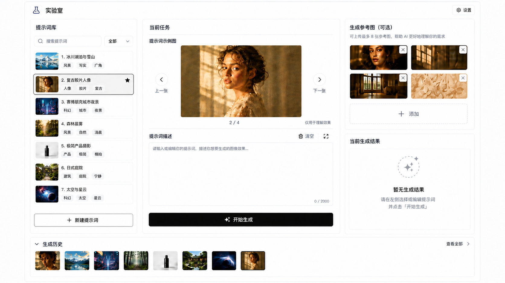

# Image Prompt Workbench 个人生成工作台设计

## 1. 文档状态

- 状态：已确认设计，待实现
- 日期：2026-08-02
- 目标：将当前的提示词卡片浏览页面调整为面向个人使用的图像生成工作台
- 约束：保留现有提示词卡片数据和多图能力；不引入社区、分享、点赞、评论、作者主页等功能

## 2. 最终视觉稿

最终采用浅色 AI 创作工作台风格：白色背景、浅灰边框、黑色主按钮、克制的圆角和阴影。页面结构以提示词编辑为中心，右侧承载生成参考图和生成结果。生成参考图使用横向长方形附件卡片，默认展示 4 个位置，有 6 张图片时自然扩展为 2 列 3 行。



设计稿文件：`docs/superpowers/specs/assets/image-prompt-workbench-final-light.png`

设计稿只作为视觉和布局基准，不代表最终文案、图片内容或后端接口已经实现。

## 3. 术语标准

项目统一使用以下三个核心术语：

### 3.1 提示词示例图

指随下载提示词一起获取的图片，用于展示该提示词可能生成的效果。

- 来源：远程提示词资料或提示词卡片
- 用途：浏览、对照和理解提示词的效果
- 状态：只读
- 默认行为：不会自动参与新的生成请求
- 交互：可以使用上一张、下一张浏览同一提示词下的多张图片

### 3.2 生成参考图

指用户在一次生图任务中主动上传或选择的图片，用于约束人物、场景、产品、构图或其他视觉特征。

- 来源：用户本地上传，或用户主动从提示词示例图、生成历史中选择
- 用途：作为本次生成请求的输入条件
- 状态：可添加、删除和替换
- 默认行为：只有被加入当前任务后才会参与生成

### 3.3 生成结果与生成历史

生成结果是当前任务实际生成出的图片。生成历史是过去生成结果的集合。

- 右侧区域显示当前生成结果
- 底部区域显示生成历史缩略图
- 查看历史图不会自动替换当前生成结果
- 历史图可以通过“作为参考图”加入新的生成任务
- 历史图可以通过“复用提示词”创建新的任务草稿

关系可以概括为：

```text
提示词示例图：用于理解别人用提示词生成过什么效果
生成参考图：用于告诉模型本次需要参考什么素材
生成结果：本次任务实际生成了什么
生成历史：过去生成过什么，并支持再次复用
```

## 4. 页面结构

页面采用左、中、右三栏加底部历史栏的结构。结构在桌面端保持稳定，不再放置重复的生成按钮。

### 4.1 左侧：提示词库

左侧用于选择和筛选提示词。

- 搜索框
- 分类筛选
- 提示词卡片列表
- 每张卡片显示一张封面图、标题和分类标签
- 封面图代表该提示词的提示词示例图，不代表生成结果
- 底部保留“新建提示词”入口

点击提示词卡片后，中间区域加载该卡片的提示词文本和提示词示例图。

### 4.2 中间：当前任务

中间区域是主要操作区，负责理解示例、编辑提示词和发起生成。

#### 提示词示例图浏览器

- 一次只显示一张图片
- 使用上一张、下一张按钮切换
- 使用 `当前序号 / 总数` 显示位置，例如 `2 / 4`
- 使用 `object-fit: contain`，不裁剪、不拉伸图片
- 图片尺寸变化时，容器尺寸保持稳定
- 显示“仅用于理解效果”提示

#### 提示词编辑器

- 显示当前提示词文本
- 支持直接编辑
- 显示清空按钮和字符数
- 允许用户在生成前修改下载的原始提示词
- 编辑内容属于当前任务草稿，不直接修改数据库中的原始提示词卡片

#### 唯一的生成按钮

中间编辑器下方只保留一个全宽黑色“开始生成”按钮。

- 页面只允许存在一个主生成入口
- 生成按钮提交当前提示词和右侧已选择的生成参考图
- 生成请求进行中时按钮进入禁用或加载状态
- 右侧不再放置第二个“开始生成”按钮

### 4.3 右侧：生成参考图与当前生成结果

右侧分为上下两个区域。

#### 生成参考图

右侧上方放置“生成参考图（可选）”。

- 使用横向长方形缩略图，建议使用约 3:2 的比例
- 默认采用 2 列 2 行，优先展示 4 个位置
- 有 6 张图片时扩展为 2 列 3 行，缩略图比例保持不变
- “添加”入口使用与图片相同尺寸和比例的虚线长方形卡片
- 每张缩略图提供删除入口
- 保留“添加”入口，用于选择本地图片
- 不同长宽比图片统一使用 contain 展示，避免裁剪
- 具体数量由后端模型适配能力决定，超过首屏可见数量时进入内部滚动或展开管理

提示词示例图和生成参考图必须在视觉上明确区分：前者只读，后者可编辑并参与当前请求。

#### 当前生成结果

右侧下方放置“当前生成结果”。

- 首次生成前显示空状态“暂无生成结果”
- 首次生成中显示加载占位和进度，不展示虚构图片
- 重新生成时可以保留上一张结果，并标记“正在生成新版本”
- 生成完成后显示当前最新结果
- 当前结果区域只显示一张大图
- 提供放大、下载和“作为参考图”等操作

## 5. 生成历史交互

底部保留“生成历史”横向区域，默认显示若干缩略图和“查看全部”入口。

### 5.1 查看历史图片

- 点击历史缩略图后打开全屏预览层
- 全屏预览只显示一张图片
- 支持上一张、下一张和关闭
- 支持下载
- 查看历史图片不会替换右侧当前生成结果

### 5.2 复用历史图片

全屏预览或历史详情中提供明确操作：

- “作为参考图”：加入当前任务右侧的生成参考图
- “复用提示词”：使用历史记录中的提示词创建任务草稿
- “设为当前结果”：在用户明确操作后替换右侧当前结果

查看、作为参考图、设为当前结果三种行为必须分开，避免点击图片后产生隐式状态变化。

## 6. 主要状态

页面需要覆盖以下状态：

| 状态 | 中间区域 | 右侧结果区域 | 主按钮 |
| --- | --- | --- | --- |
| 未选择提示词 | 提示选择提示词 | 空状态 | 不可用 |
| 已选择提示词 | 显示示例图和提示词 | 空状态 | 可用 |
| 首次生成中 | 保留任务输入 | 加载占位和进度 | 加载中 |
| 重新生成中 | 保留当前编辑内容 | 上一结果加生成遮罩 | 加载中 |
| 生成成功 | 保留任务输入 | 显示最新结果 | 可再次生成 |
| 生成失败 | 保留任务输入 | 显示错误原因和重试 | 可重试 |

错误信息应显示在当前结果区域附近，不使用无法追溯的全局弹窗替代上下文提示。

## 7. 视觉规范

- 主题：浅色
- 页面背景：白色或极浅灰色
- 面板：白色，使用浅灰色细边框
- 主文字：近黑色
- 主按钮：黑色背景、白色文字
- 次要按钮：白色背景、黑色边框和文字
- 圆角：统一使用小圆角，避免按钮、卡片和面板混用不同形状体系
- 阴影：轻量、低对比度，仅用于层级区分
- 图片：保持原始比例，默认使用 `contain`
- 动效：只用于加载、切换、预览打开和按钮反馈，不做装饰性循环动画
- 可访问性：按钮文字、输入框文字和焦点状态需要满足可读性要求

## 8. 数据与实现边界

当前提示词卡片数据中的 `images` 数组代表提示词示例图，不应与用户上传的生成参考图或生成历史混用。

建议在任务状态中单独维护：

```text
当前提示词卡片
当前提示词草稿
当前提示词示例图索引
当前生成参考图列表
当前生成结果
生成历史列表
生成状态与错误信息
```

原始提示词卡片保持只读。用户编辑的是任务草稿，生成结果和历史记录写入独立的生成记录，不回写下载的提示词内容。

## 9. 验收标准

- 页面只显示一个“开始生成”主按钮
- 提示词示例图一次只显示一张，并支持上一张、下一张
- 示例图不会被裁剪或拉伸
- 生成参考图位于右侧，使用小缩略图显示
- 生成参考图支持添加和删除
- 首次生成前右侧结果区域为空
- 生成历史位于底部，查看历史时打开全屏预览
- 查看历史不会隐式替换当前生成结果
- 历史图片可以明确作为生成参考图复用
- 所有社交相关信息不出现在个人工作台中
- 桌面端布局与本设计稿保持一致

## 10. 不在本次设计范围内

- 社区、作者、点赞、评论、分享和关注
- 用户注册、多用户权限和计费
- 在线 API 设置页面
- 完整图片编辑器
- 移动端专门布局
- 多模型管理界面
- 生成模型具体参数的最终字段设计
